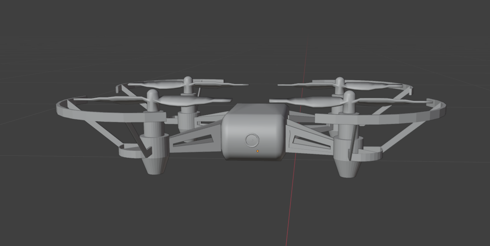
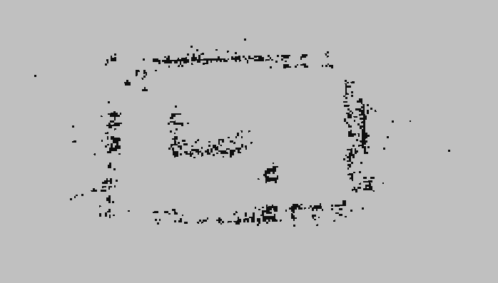
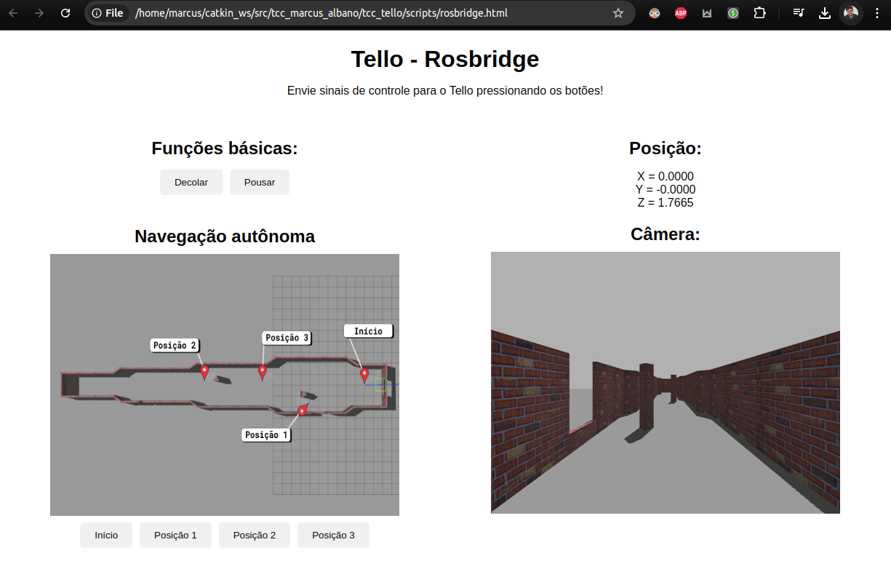

# Utilização do veículo aéreo não tripulado Tello para mapeamento, navegação autônoma, detecção e rastreamento de pessoas 

O projeto foi desenvolvido buscando utilizar o DJI Tello para realizar vigilância de ambientes internos. Para isso, foram implementadas todas as funções necessárias, adaptando e utilizando pacotes já existentes e criando novos scripts.

O Tello demonstrou ser capaz de realizar as ações de mapeamento utilizando o pacote [ORB-SLAM3](https://github.com/UZ-SLAMLab/ORB_SLAM3), juntamente com o pacote [Octomap](http://wiki.ros.org/octomap) para a criação de um mapa 3D, que permitiu a navegação autônoma do Tello, por meio do pacote [Move_Base](http://wiki.ros.org/move_base) e a odometria do drone.

Também foi utilizado o classificador de faces da biblioteca [OpenCV Haar Cascade](https://docs.opencv.org/3.4/db/d28/tutorial_cascade_classifier.html) para que o drone identificasse pessoas em seu caminho e começasse o processo de rastreamento. 

Foi desenvolvido um script de envio automático de e-mail contendo a foto da face detectada e um painel de controle utilizando o pacote [RosBridge](http://wiki.ros.org/rosbridge_suite).

O projeto foi realizado em ambientes real, utilizando o drone Tello e também foi desenvolvido em ambiente simulado utilizando o Gazebo. 

<p align="center">
  <a href="https://youtu.be/q3dZaqaDLLk">
    
  </a>
  <a href="https://youtu.be/2wZg1Nzsiqk">
    
  </a>
</p>

## Pré-requisitos:

- SO: Ubuntu 20.04.5 LTS

- ROS Noetic - [Guia de instalação](https://github.com/albanomarcus/tcc_marcus_albano/blob/1f0949a211ce8cd17a3977a1c874e357e6c01436/ROS_Install.md)

- Clonar pacote:
```
cd ~/catkin_ws/src
git clone https://github.com/albanomarcus/tello_pkg.git
```
## Comunicação Tello-ROS e Teleoperação
Para realizar a comunicação com o drone real é necessário instalar pacotes dependentes e clonar os diretórios atualizados para Python3.

No terminal: 

```
sudo apt install ros-noetic-cv-bridge
cd ~/catkin_ws/src
git clone --recursive https://github.com/albanomarcus/tello_driver.git
git clone https://github.com/albanomarcus/camera_info_manager_py.git
catkin build && source devel/setup.bash
```

Para inicializar os tópicos responsáveis pela comunicação com o Tello: 

No terminal #1: 
```
roslaunch tello_pkg tello_node.launch
```

Para teleoperar o Tello utilizando o teclado do computador:

No terminal #2:
```
roslaunch tello_pkg tello_control.launch
```

## Simulação
Foi utilizado o pacote [Hector Quadrotor adaptado para ROS Noetic](https://github.com/RAFALAMAO/hector_quadrotor_noetic.git) como base para a simulação, porém foi criado um novo modelo 3D e um novo arquivo URDF para o Tello.

<p align="center">
  
</p>
Para instalar o ambiente de simulação:

No terminal:
```
git clone https://github.com/RAFALAMAO/hector_quadrotor_noetic.git
catkin build && source devel/setup.bash
```

Para inicializar os tópicos responsáveis pela simulação do Tello: 

No terminal #1: 
```
roslaunch tello_pkg gazebo_tello_node.launch
```

Para teleoperar o Tello na simulação utilizando o teclado do computador:

No terminal #2:
```
roslaunch tello_pkg gazebo_tello_control.launch
```

## Mapeamento
Para realizar o mapeamento foram utilizados os pacotes ORB-SLAM3 e Octomap, juntamente com um script criado para aplicar uma escala aos pontos gerados pelo octomap, devido a escala original não corresponder a escala real.


<p align="center">
  <a href="https://youtu.be/Bah-9Z6bp30">
    
  </a>
</p>


Para instalar o OBR-SLAM3, seguir o [Guia de instalação](https://github.com/albanomarcus/tcc_marcus_albano/blob/eee8ddd550129006369752c2910a9d61d42f0281/ORB-SLAM3_instructions.md)

Para instalar o Octomap:
```
sudo apt install ros-noetic-octomap
```

Após a intalação, inicializar o OrbSlam3 (seja na simulação ou utilizando o Tello).

No terminal:
```
roslaunch tello_pkg tello_orb_slam.launch
```

Após teleoperar o Tello pelo ambiente, escolher dois pontos conhecidos no ambiente mapeado e seus pontos respectivos gerados pelo ORB-SLAM3. Alterar o arquivo scale_define.py com os dados escolhidos e executar o seguinte comando para obter o valor de escala.

No terminal:
```
rosrun tello_pkg scale_define.py
```

Com o valor da escala em mãos alterar o script scale_adjustment.py e ao final da geração da nuvem de pontos pelo ORB-SLAM3 executar o comando para aplicação da escala e geração do mapa utilizando o Octomap.

No terminal:
```
roslaunch point_cloud_manipulation.launch
```

O mapa gerado possui pontos desconhecidos que podem afetar a navegação autônoma, para isso recomenda-se aplicar uma correção, onde os pontos desconhecidos tornam-se pontos conhecidos e navegáveis. Utilizando o script criar_mapas.py, foram criados mapas navegáveis com as mesmas dimensões dos mapas existentes e com o script mesclar_mapas.py foi realizada a fusão dos novos mapas com os mapas previamente obtidos.

<p align="center">
  
</p>

## Navegação Autônoma
Para realizar a navegação autônoma, é necessário instalar os seguintes pacotes dependentes:

No terminal:
```
sudo apt install ros-noetic-move-base
sudo apt-get install ros-noetic-global-planner
sudo apt install ros-noetic-map-server
```

Executando a navegação autônoma
- Utilizando o Tello:

  No terminal #1 realizar a comunicação Tello-ROS:
  ```
  roslaunch tello_pkg tello_node.launch
  ```

  No terminal #2 realizar a teleoperação para pouso e decolagem:
  ```
  roslaunch tello_pkg tello_control.launch
  ```  

  No terminal #3 abrir o mapa gerado, configurar o move_base e inicializar a navegação autônoma após o drone estar voando:
  ```
  roslaunch tello_pkg tello_navigation.launch
  ```  

- Utilizando a Simulação:

  No terminal #1 realizar a comunicação Tello-ROS:
  ```
  roslaunch tello_pkg gazebo_tello_node.launch
  ```

  No terminal #2 realizar a teleoperação para pouso e decolagem:
  ```
  roslaunch tello_pkg gazebo_tello_control.launch
  ```  

  No terminal #3 abrir o mapa gerado, configurar o move_base e inicializar a navegação autônoma após o drone estar voando:
  ```
  roslaunch tello_pkg gazebo_navigation.launch
  ```  


## Detecção e rastreamento de faces
O processo de detecção e rastreamento de faces utiliza o classificador Haar Cascade da biblioteca OpenCV. Ao detectar a primeira face, a navegação autônoma é interrompida, uma imagem da face é capturada e enviada por e-mail utilizando o script email_sender.py e o drone inicializa o procedimento de rastreamento da face, seguindo a face da pessoa encontrada até acabar a bateria ou receber um comando de intervenção. 

Para inicializar o procedimento, executar no terminal #4:
```
roslaunch tello_pkg tello_face_tracking_and_send_email.launch
```

O script de envio de e-mails (email_sender.py) é passível de personalização.


## Painel de Controle

<p align="center">
  
</p>

Para a criação do painel de controle via WebSocket, foi utilizado o pacote RosBridge_suite, para instalá-lo:

No terminal:
```
sudo apt-get install ros-noetic-rosbridge-suite
```

Com a navegação autônoma executando, abrir o painel de controle:

No terminal #5:
```
roslaunch tello_pkg tello_rosbridge.launch
```

## Exemplos de funcionamento
Utilizando apenas um comando é possível executar todos os processos descritos anteriormente.

- Utilizando o Tello:
  ```
  roslaunch tello_pkg tello_node_complete.launch
  ```
- Simulação
  ```
  roslaunch tello_pkg gazebo_tello_complete.launch
  ```

### REFERÊNCIAS:

CAMPOS, C. et al. ORB-SLAM3: An accurate open-source library for visual, visual-inertial
and multi-map SLAM. IEEE Transactions on Robotics, v. 37, n. 6, p. 1874–1890, 2021.
Disponível em: <https://github.com/UZ-SLAMLab/ORB_SLAM3>.

HORNUNG, A. et al. OctoMap: An efficient probabilistic 3D mapping framework based
on octrees. Autonomous Robots, 2013. Disponível em: <https://octomap.github.io>.

Wiki ROS: <http://wiki.ros.org>


